# vg 1.0 模块分析

## 1.1 工具方法

| 方法 | 描述| 备注 |
|-----|----|------|
|vg.version|版本号| |
|vg.isObject|是否是对象||
|vg.accessor|属性访问||
|vg.array|将对象封装到数组||
|vg.str|对象转字符串||
|vg.keys|获取对象的属性名集合||
|vg.unique|数据去重||
|vg.log|日志输出||
|vg.error|输出错误信息||


## 1.2 vg.canvas

canvas 是绘图对象，包含以下几个组成部分：


| 模块 | 描述| 备注 |
|-----|----|------|
|path|路径和图形绘制| |
|marks|定义了不同类型的mark和symbol，组织数据，调用绘图方法绘制| |
|render|初始化canvas context，根据scene graph信息调度绘制整个画面内容| |
|handler|处理鼠标和键盘事件| |


### 1.2.1 vg.canvas.Renderer

封装了Canvas 元素和绘图上下文。

| 模块 | 类型|描述| 备注 |
|-----|----|------|----|
|_ctx||Canvas上下文| |
|_el||canvas dom| |
|initialize||初始化dom 和 ctx| |


构造函数如下：

```js
 var renderer = function() {
    this._ctx = null;
    this._el = null;
  };
```

vg.View 模块会初始化其render属性。

#### 1.2.1.1 initialize

源码如下：

```js
prototype.initialize = function(el, width, height, pad) {
    this._el = el;
    this._width = width;
    this._height = height;
    this._padding = pad;

    // select canvas element
    var canvas = d3.select(el)
      .selectAll("canvas")
      .data([1]);
    
    // create new canvas element if needed
    canvas.enter()
      .append("canvas");
    
    // initialize canvas attributes
    canvas
      .attr("width", width + pad.left + pad.right)
      .attr("height", height + pad.top + pad.bottom);
    
    // get the canvas graphics context
    this._ctx = canvas.node().getContext("2d");
    this._ctx.setTransform(1, 0, 0, 1, pad.left, pad.top);
    
    return this;
  };
```


### 1.2.2 vg.canvas.Handler

| 模块 | 类型|描述| 备注 |
|-----|----|------|----|
|_active|属性|是否激活| |
|_handlers|属性|外部注册的事件回调| |
|_scene|属性|vg.Scene类型，从view传入|
|initialize|方法|canvas监听鼠标事件| |
|scene|方法|赋值_scene||
|on|方法|添加事件监听||
|off|方法|remove an event handler||


构造函数如下：

```js
  var handler = function(el, scene) {
    this._active = null;
    this._handlers = {};
    if (el) this.initialize(el);
    if (scene) this.scene(scene);
  };

   var prototype = handler.prototype;

  prototype.initialize = function(el, pad) {
    this._el = d3.select(el).node();
    this._canvas = d3.select(el).select("canvas").node();
    this._padding = pad;
    
    // add event listeners
    var canvas = this._canvas, that = this;
    events.forEach(function(type) {
      canvas.addEventListener(type, function(evt) {
        prototype[type].call(that, evt);
      });
    });
    
    return this;
  };
```

initialize 函数将要监听的事件绑定到canvas上。


## 1.3 vg.data

data 模块用来对数据进行读取、分析、转换。

### 1.3.1 ingest 方法

```js
vg.data.ingest = function(datum, index) {
  return {
    data: datum,
    index: index
  };
};
```

该方法将传入的data数据包装成一个对象。


## 1.4 vg.parse

转换spec 到View。

| 模块 | 类型|描述| 备注 |
|-----|----|------|----|
|axes||坐标轴的spec定义转换到对应的领域对象| |
|data||data的spec定义转换到对应的领域对象| |
|dataflow||返回transform函数| |
|marks||marks的spec定义转成对应的领域对象| |
|properties||mark的属性转换为赋值对象或者函数| |
|scales||根据spec中的scale定义，操作range，domain等数据，返回一个scale函数||
|transform||根据transform定义，返回transform函数||
|spec|函数|转换spec到view||


### 1.4.1 vg.parse.spec

```Js
vg.parse.spec = function(spec, callback) {
  
  function parse(spec) {
    var model = {
      scales: spec.scales,
      axes: spec.axes,
      marks: vg.parse.marks(spec.marks),
      data: vg.parse.data(spec.data, function() { callback(chart); })
    };

    var chart = function(el, input) {
      return new vg.View()
        .width(spec.width || 500)
        .height(spec.height || 500)
        .padding(spec.padding || {top:20, left:20, right:20, bottom:20})
        .viewport(spec.viewport || null)
        .initialize(el)
        .model(model)
        .data(model.data.load)
        .data(input)
        .on("mouseover", function(evt, item) {
          view.update("hover", item);
        })
        .on("mouseout", function(evt, item) {
          view.update("update", item);
        });
    };
  }
  
  vg.isObject(spec) ? parse(spec) :
    d3.json(spec, function(error, json) {
      error ? vg.error(error) : parse(json);
    });
};
```
如上代码所示，先生成model：

```js
  var model = {
      scales: spec.scales,
      axes: spec.axes,
      marks: vg.parse.marks(spec.marks),
      data: vg.parse.data(spec.data, function() { callback(chart); })
    };
```
注意这里的marks和data，marks的properties（update，enter等）内部的属实赋值转换为赋值函数。
data 转换为包装了transform的函数。

vg.parse.data 执行数据的加载，返回一个load和flow两个属性的对象：

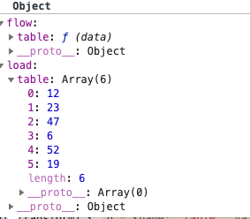

load属性下是data的数据，对应传入的values。flow为对transform的封装：

```js
    if (d.transform) {
      model.flow[d.name] = vg.parse.dataflow(d);
    }
```
vg.parse.dataflow 源码如下：

```js
vg.parse.dataflow = function(def) {
  var tx = (def.transform || []).map(vg.parse.transform);
  return !tx.length ? vg.identity :
    function(data) {
      var that = this;
      return tx.reduce(function(d,t) { return t.call(that, d); }, data);
    };
}
```


上图中的tx即为spec定义的transform方法，后续在需要的时候会调用修改数据。

data parse完成之后，返回一个chart函数，chart函数用来初始化vg.View。

调用chart 方法，传入container 元素，和data，依次初始化View的属性。


```js
    var chart = function(el, input) {
      return new vg.View()
        .width(spec.width || 500)
        .height(spec.height || 500)
        .padding(spec.padding || {top:20, left:20, right:20, bottom:20})
        .viewport(spec.viewport || null)
        .initialize(el)
        .model(model)
        .data(model.data.load)
        .data(input)
        .on("mouseover", function(evt, item) {
          view.update("hover", item);
        })
        .on("mouseout", function(evt, item) {
          view.update("update", item);
        });
    };
  }
```

构造过程：
1. 首先不传入任何参数，构造默认的View 实例。见 1.7.3
2. 初始化height，width,padding,viewport 。简单的变量赋值
3. initialize 见 1.7.4.
   初始化坐标轴容器，render和hangdler
   执行完initialize之后，DOM结构如下：
  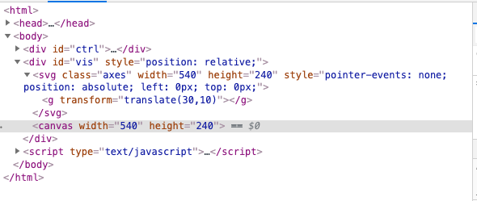

4.  初始化model，见 1.7.5
5. 处理data，内部传递给view的_scene对象，执行transform，保存转换后的数据到_scene对象上。详见1.7.6 和 1.7.2。

最后调用on绑定 mouseover 和 mouseout，以处理在spec中定义的 hover 和 update 属性的处理逻辑。


## 1.6 vg.scene && vg.Scene
 vg.Scene 是一个类定义，g.scene是对象，提供了操作Scene的工具方法。


构建和更新scenegraph。对象组成：

| 模块 | 类型 | 描述| 备注 |
|-----|------|-----|------|
|_model|属性| |
|_axes| 属性 | 坐标轴|
|_data| 属性 | |
|_root| 属性 | |
|_width| 属性 | |
|_height|属性||
|_padding|属性||
|data|函数|依次执行挂载在parse模块的data对象上的flow函数，结果存在_data对象上||
|build|函数|构建 scenegraph||
|width|函数|赋值_width|
|height|函数|赋值_height|
|padding|函数|赋值_padding|
|initialize|函数|初始化|


### 1.6.1 _model

由来自vg.parse 模块产生的scales、axes、marks和data 对象组成

```Js
 var model = {
      scales: spec.scales,
      axes: spec.axes,
      marks: vg.parse.marks(spec.marks),
      data: vg.parse.data(spec.data, function() { callback(chart); })
    };
```

### 1.6.2 data函数
依次执行挂载在parse模块的data对象上的flow函数（spec定义的transform)，结果存在_data对象上。

```js
  prototype.data = function(data) {
    if (!arguments.length) return this._data;
    var dat = this._data,
        tx = this._model ? this._model.data.flow : {};
    vg.keys(data).forEach(function(k) {
      dat[k] = tx[k] ? tx[k].call(dat, data[k]) : data[k];
    });
    return this;
  };
```
（vg.View 初始化data时会调用该函数）

起始状态下，this._data值为空对象。下面举例说明：

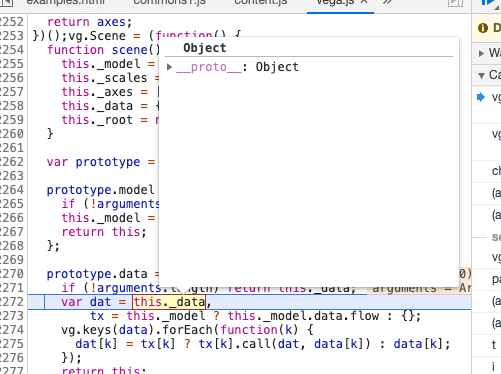

传入的数据格式如下：

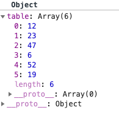

tx如下：

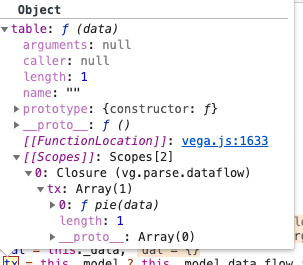

tx的key为“table” 对应数据集中数据的名字，value为对transfrom的封装方法，从Scope可以看出这里封装了工具函数vg.data.pie。

经过transform之后，数据变为如下形式：

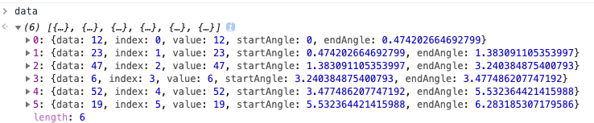


### 1.6.3 _root

### 1.6.4 build

在build marks阶段，marks的from属性在parse阶段被封装成一个函数，

## 1.7 vg.View

一个图表的领域模型，定义了图表的组成部分，提供了各部分的初始化方法。


### 1.7.1 构造函数

构造函数如下：
```js
  var view = function(el, width, height) {
    this._el = null;
    this._build = false;
    this._scene = new vg.Scene();
    this._width = width || 500;
    this._height = height || 500;
    this._padding = {top:0, left:0, bottom:0, right:0};
    this._viewport = null;
    if (el) this.initialize(el);
  };
```

### 1.7.2 width

### 1.7.3 height

### 1.7.4 initialize

初始化。代码如下：

```js
prototype.initialize = function(el) {
    // div container
    this._el = d3.select(el)
      .style("position", "relative")
      .node();
    if (this._viewport) {
      var vw = this._viewport[0] || this._width,
          vh = this._viewport[1] || this._height;
      d3.select(el)
        .style("width", vw+"px")
        .style("height", vh+"px")
        .style("overflow", "auto");
    }
    
    // axis container
    this._axes = (this._axes || new vg.Axes)
      .initialize(this._el, this._width, this._height, this._padding);
    
    // renderer
    this._renderer = (this._renderer || new vg.canvas.Renderer())
      .initialize(this._el, this._width, this._height, this._padding);
    
    // input handler
    if (!this._handler) {
      this._handler = new vg.canvas.Handler()
        .initialize(this._el, this._padding)
        .scene(this._scene);
    }
    
    return this;
  };
  ```

首先存储传入的el 作为整个图表的Container，根据_viewport的信息（宽高）设置container的样式。

接下来初始化坐标轴，详见1.8.1。初始化坐标之后，dom结构如下：
  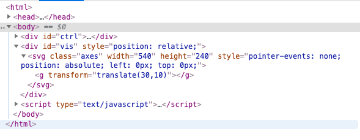

接着初始化 _renderer：

```Js
   // renderer
    this._renderer = (this._renderer || new vg.canvas.Renderer())
      .initialize(this._el, this._width, this._height, this._padding);
```
详见1.2.1。

最后初始化_handler，所有的事件挂载在Canvas上，传入handler需要的scene对象。详见1.2.2.


```js
 // input handler
    if (!this._handler) {
      this._handler = new vg.canvas.Handler()
        .initialize(this._el, this._padding)
        .scene(this._scene);
    }
```

### 1.7.5 model

代码如下：

```js
 prototype.model = function(model) {
    if (!arguments.length) return this._scene.model();
    this._scene.model(model);
    return this;
  };
```

传入的model对象内容如下：

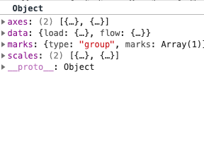

接收对象后，调用

```js
this._scene.model(model);
```

将vg.parse.spec.parse  之后产生的model传给vg.Scene的model方法，进行赋值。

### 1.7.6 data

data 方法源码如下：

```js
  prototype.data = function(data) {
    if (!arguments.length) return this._scene.data();
    var ingest = vg.keys(data).reduce(function(d, k) {
      return (d[k] = data[k].map(vg.data.ingest), d);
    }, {});
    this._scene.data(ingest);
    return this;
  };
```

data方法接收传入的数据，依次调用vg.data.ingest方法对数据进行处理。处理前数据如下：

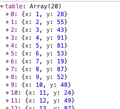

处理之后，结果如下：

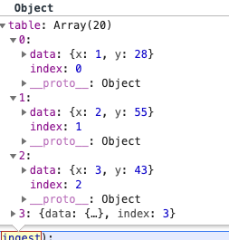

随后调用

```js
 this._scene.data(ingest);
```
对vg.Scene 的_data进行重新数据项赋值。详见 

### 1.7.7 update 

update 方法在上面准备数据的基础上，进行 scengraph 的构建和渲染工作。源码如下：

```js
 
  prototype.update = function(request, items) {
    this._build = this._build || (this._scene.build(), true);
    this._scene.encode(request, items);
    
    function bounds() {
      return !items ? null :
        vg.array(items).reduce(function(b, x) {
          return b.union(x.item.bounds);
        }, new vg.Bounds());  
    }
    
    this.render(bounds());
    return items ? this.render(bounds()) : this;
  };
  ```

update 分三步执行：build，encode，render


#### 1.7.7.1 build

  根据上面的代码，第一步是构建scengraph，调用方法build。代码如下：

  ```js
      this._root = vg.scene.build.call(this,
      this._model.marks, this._data, this._root);

    vg.parse.scales(this._model.scales, this._scales, this._data);
    vg.parse.axes(this._model.axes, this._axes, this._scales);
    return this;
  };
```
build 分三步： build，scales，axes，下面分别介绍：

<b>---build</b>

先构节点，vg.scene.build 方法如下：
```js
  function build(model, db, node, parentData) {
    var data = model.from ? model.from(db) : parentData || [1];
    if (!Array.isArray(data) && vg.isObject(data) && data.values) data = data.values;
    
    // build node and items
    node = buildNode(model, node);
    node.items = buildItems(model, data, node);
    
    // recurse if group
    if (model.type === GROUP) {
      buildGroup(model, db, node);
    }
    
    return node;
  };
```
model 在 parse 阶段被封装成 type 为group的mark对象，没有data属性。

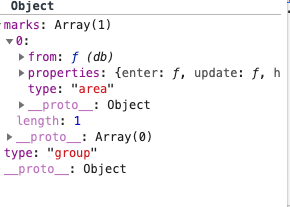

对于找不到data的节点，默认赋值为数组 [1]。

接下来调用buildNode方法，构建节点，代码如下：

```js
 function buildNode(model, node) {
    node = node || {};
    node.def = model;
    node.marktype = model.type;
    node.interactive = !(model.interactive === false);
    return node;
  }

```

buildNode 执行完毕返回后，现在sceneGraph只有一个根节点，内容如下：

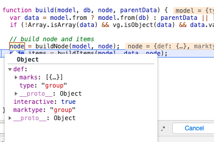

传入的mode 作为根节点的def 被完整保存下来，interactive 属性标识该节点是否响应用户的鼠标事件。
接下里要构建子节点，调用 buildItems 方法。buildItems执行完毕之后，节点数据如下：

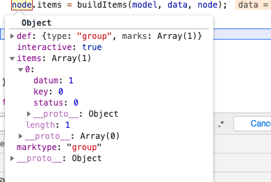

因为根节点的 type 为 group，所以会继续执行 buildGroup 方法。

```js
function buildGroup(model, db, node) {
    var groups = node.items,
        marks = model.marks,
        i, len, m, mlen, group;

    for (i=0, len=groups.length; i<len; ++i) {
      group = groups[i];
      group.items = group.items || [];
      for (m=0, mlen=marks.length; m<mlen; ++m) {
        group.items[m] = build(marks[m], db, group.items[m], group.datum);
      }
    }
  }
```

根节点的item只有一个item，作为buildGroup中的group节点，继续向下构造，递归调用。如下图：

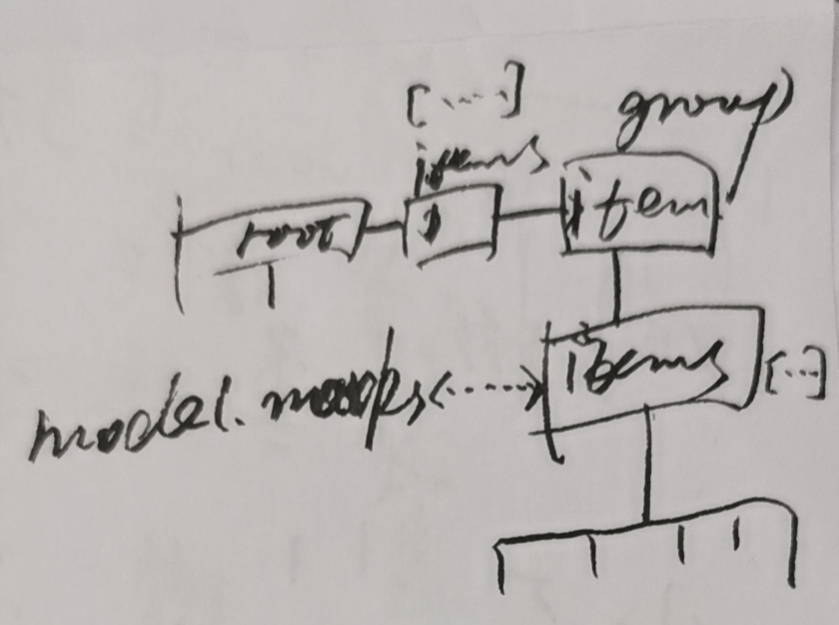

本例中，marks中的mark作为下一级节点被构造。传入数据如下：

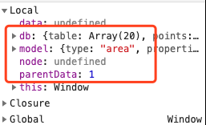

新一轮的build开启，传入的model为spec中的第一个mark。

回到build方法的起始位置：

```js
   var data = model.from ? model.from(db) : parentData || [1];
    if (!Array.isArray(data) && vg.isObject(data) && data.values) data = data.values;
```
 
在parse阶段，mark 的from 字段被封装成一个函数，用于执行data上定义的transform。之后取出values。
之后构造这一级的根节点。然后构造其items。

marks 构造完成之后，大概可以得到如下的节点数据：

```JSON
{
    "def":{
        "type":"group",
        "marks":[
            {
                "type":"area",
                "properties":{

                }
            }
        ]
    },
    "marktype":"group",
    "interactive":true,
    "items":[
        {
            "status":0,
            "datum":1,
            "key":0,
            "items":[
                {
                    "def":{
                        "type":"area",
                        "properties":{
//  对象中是对应属性的function
                        }
                    },
                    "marktype":"area",
                    "interactive":true,
                    "items":[
                        {
                            "status":0,
                            "datum":{
                                "data":{
                                    "x":1,
                                    "y":28
                                },
                                "index":0
                            },
                            "key":0
                        },
                        {
                            "status":0,
                            "datum":{
                                "data":{
                                    "x":2,
                                    "y":55
                                },
                                "index":1
                            },
                            "key":1
                        },
                        {
                            "status":0,
                            "datum":{
                                "data":{
                                    "x":3,
                                    "y":43
                                },
                                "index":2
                            },
                            "key":2
                        },
                        {
                            "status":0,
                            "datum":{
                                "data":{
                                    "x":4,
                                    "y":91
                                },
                                "index":3
                            },
                            "key":3
                        },
                        {
                            "status":0,
                            "datum":{
                                "data":{
                                    "x":5,
                                    "y":81
                                },
                                "index":4
                            },
                            "key":4
                        },
                        {
                            "status":0,
                            "datum":{
                                "data":{
                                    "x":6,
                                    "y":53
                                },
                                "index":5
                            },
                            "key":5
                        },
                        {
                            "status":0,
                            "datum":{
                                "data":{
                                    "x":7,
                                    "y":19
                                },
                                "index":6
                            },
                            "key":6
                        },
                        {
                            "status":0,
                            "datum":{
                                "data":{
                                    "x":8,
                                    "y":87
                                },
                                "index":7
                            },
                            "key":7
                        },
                        {
                            "status":0,
                            "datum":{
                                "data":{
                                    "x":9,
                                    "y":52
                                },
                                "index":8
                            },
                            "key":8
                        },
                        {
                            "status":0,
                            "datum":{
                                "data":{
                                    "x":10,
                                    "y":48
                                },
                                "index":9
                            },
                            "key":9
                        },
                        {
                            "status":0,
                            "datum":{
                                "data":{
                                    "x":11,
                                    "y":24
                                },
                                "index":10
                            },
                            "key":10
                        },
                        {
                            "status":0,
                            "datum":{
                                "data":{
                                    "x":12,
                                    "y":49
                                },
                                "index":11
                            },
                            "key":11
                        },
                        {
                            "status":0,
                            "datum":{
                                "data":{
                                    "x":13,
                                    "y":87
                                },
                                "index":12
                            },
                            "key":12
                        },
                        {
                            "status":0,
                            "datum":{
                                "data":{
                                    "x":14,
                                    "y":66
                                },
                                "index":13
                            },
                            "key":13
                        },
                        {
                            "status":0,
                            "datum":{
                                "data":{
                                    "x":15,
                                    "y":17
                                },
                                "index":14
                            },
                            "key":14
                        },
                        {
                            "status":0,
                            "datum":{
                                "data":{
                                    "x":16,
                                    "y":27
                                },
                                "index":15
                            },
                            "key":15
                        },
                        {
                            "status":0,
                            "datum":{
                                "data":{
                                    "x":17,
                                    "y":68
                                },
                                "index":16
                            },
                            "key":16
                        },
                        {
                            "status":0,
                            "datum":{
                                "data":{
                                    "x":18,
                                    "y":16
                                },
                                "index":17
                            },
                            "key":17
                        },
                        {
                            "status":0,
                            "datum":{
                                "data":{
                                    "x":19,
                                    "y":49
                                },
                                "index":18
                            },
                            "key":18
                        },
                        {
                            "status":0,
                            "datum":{
                                "data":{
                                    "x":20,
                                    "y":15
                                },
                                "index":19
                            },
                            "key":19
                        }
                    ]
                }
            ]
        }
    ]
}
```

现在简单总结一下，build过程，就是将图表中的mark定义和数据结合起来，构建每个节点，这个简单只是对节点进行的定义，设置初始状态，挂接datam。

<b>---scales</b> 

build 执行完毕之后，调用 vg.parse.scales 方法，执行 scales 变换。

```js
    vg.parse.scales(this._model.scales, this._scales, this._data);

```

```js
 function scales(spec, scales, db) {
    return (spec || []).reduce(function(o, def) {
      o[def.name] = scale(def, o[def.name], db);
      return o;
    }, scales || {});
  }
```

scales 方法 遍历定义的scale，依次调用 scale 方法，进行转换。

```js
 function scale(def, scale, db) {
    var type = def.type || LINEAR,
        s = scale || d3.scale[type](),
        rng = range(def, s);
    (type===ORDINAL ? ordinal : quantitative)(def, s, rng, db);
    return s;
  }
```

得到d3中对应的scale 工具方法，然后调用 range 方法，计算range，主要是转换“width”、“height”，“max”，“min” 等关键字

接下来区分是 ordinal 还是 quantitative 类型，返回不同的 scale 方法。

scales 执行完毕之后，添加了scale方法：

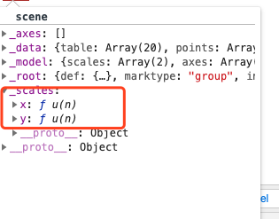


<b>---axes</b> 


```js
vg.parse.axes(this._model.axes, this._axes, this._scales);
```

vg.parse.axes 代码如下：

```
 function axes(spec, axes, scales) {
    (spec || []).forEach(function(def, index) {
      axes[index] = axes[index] || d3.svg.axis();
      axis(def, index, axes[index], scales);
    });
  };
```
依次调用axis 方法生成坐标轴，方法执行完毕之后，如下：

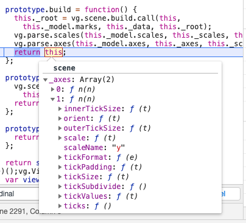

#### 1.7.7.2  encode

build之后 执行encode. 计算出每一个item 实际是x,y,fill width,height 等绘图属性。

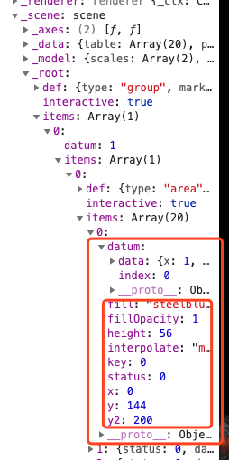


#### 1.7.7.3 render

encode 执行完毕之后，执行render进行渲染。

```js
  prototype.render = function(bounds) {
    var s = this._scene;
    this._axes.update(s._axes, s._scales);
    this._renderer.render(s.root(), bounds);
    return this;
  };
```

render方法先更新 _axes（axes 是svg绘制的，单独更新）。 然后调用  renderer 模块的render方法进行绘图。


##  1.8 vg.Axes

| 模块 | 类型 | 描述| 备注 |
|-----|------|-----|------|
|_svg|属性|绘制坐标轴|
|_width| 属性 | 宽|
|_height| 属性 |高 |
|_padding| 属性 | 边距|
|_init| 属性 | 是否已经初始化|
|_el|属性|包含坐标轴的dom元素|
|initialize|函数|初始化|
|element|函数|返回_el|
|update|函数|初始化svg，更新位置，大小|

### 1.8.1 initialize

源码如下：

```js
prototype.initialize = function(el, width, height, pad) {
    this._el = el;
    this._width = width;
    this._height = height;
    this._padding = pad;

    // select axis svg element
    var axes = d3.select(el)
      .selectAll("svg.axes")
      .data([1]);
    
    // create new svg element if needed
    axes.enter()
      .append("svg")
      .style("pointer-events", "none");
    
    // initialize svg attributes
    axes
      .attr("class", "axes")
      .attr("width", width + pad.left + pad.right)
      .attr("height", height + pad.top + pad.bottom)
      .style({position:"absolute", left:0, top:0});

    var g = axes.selectAll("g").data([1]);
    g.enter().append("g");
    g.attr("transform", "translate("+pad.left+","+pad.top+")");

    this._init = false;
    return this;
  };
```

执行完initialize之后，DOM结构如下：


